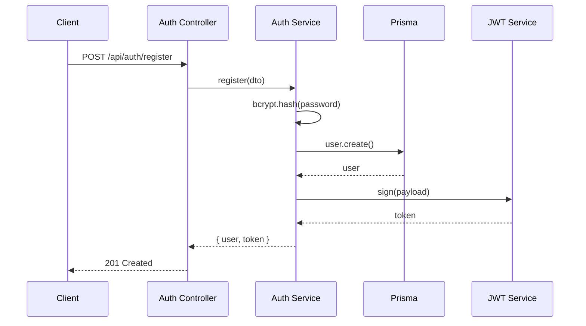
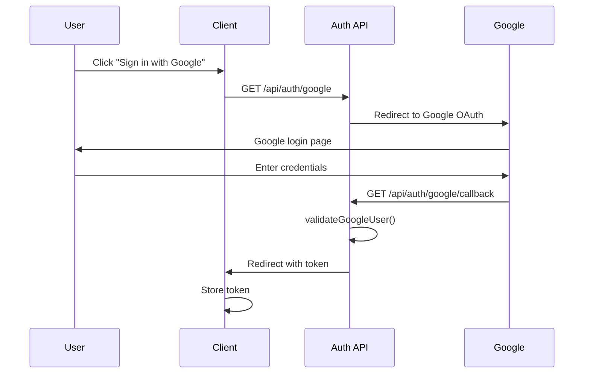

## Overview

Your Finance App implements a robust authentication system supporting both **local authentication** (email/password) and **OAuth providers** (Google). The system uses **JWT tokens** for stateless authentication and **bcrypt** for password hashing.

## Authentication Flow



## Module Structure

The authentication module is organized as follows:

```
auth/
├── auth.module.ts          # Module definition
├── auth.service.ts         # Business logic
├── auth.controller.ts      # HTTP endpoints
├── strategies/
│   ├── jwt.strategy.ts     # JWT validation
│   └── google.strategy.ts  # Google OAuth
├── guards/
│   ├── jwt-auth.guard.ts   # JWT protection
│   ├── google-auth.guard.ts
│   └── roles.guard.ts      # Role-based access
├── decorators/
│   ├── current-user.decorator.ts
│   └── roles.decorator.ts
├── dto/
│   ├── register.dto.ts
│   └── login.dto.ts
└── interfaces/
    ├── jwt-payload.interface.ts
    ├── user-payload.interface.ts
    └── google-user.interface.ts
```

## Auth Module Configuration

<CodeGroup>
```typescript apps/backend/src/auth/auth.module.ts
import { Module } from '@nestjs/common';
import { JwtModule } from '@nestjs/jwt';
import { PassportModule } from '@nestjs/passport';
import { AuthController } from './auth.controller';
import { AuthService } from './auth.service';
import { JwtStrategy } from './strategies/jwt.strategy';
import { GoogleStrategy } from './strategies/google.strategy';

@Module({
  imports: [
    PassportModule,
    JwtModule.register({
      global: true,
      secret: process.env.JWT_SECRET || 'your-secret-key-change-in-production',
      signOptions: {
        expiresIn: '7d',  // Token valid for 7 days
      },
    }),
  ],
  controllers: [AuthController],
  providers: [AuthService, JwtStrategy, GoogleStrategy],
})
export class AuthModule {}
```
</CodeGroup>

<Warning>
Always set `JWT_SECRET` in your environment variables. The default value is for development only.
</Warning>

## Registration Flow

### Registration Endpoint

<CodeGroup>
```typescript apps/backend/src/auth/auth.controller.ts
@Post('register')
async register(@Body() dto: RegisterDto) {
  return this.authService.register(dto);
}
```
</CodeGroup>

### Registration Service Logic

<CodeGroup>
```typescript apps/backend/src/auth/auth.service.ts
async register(dto: RegisterDto) {
  const { email, password, firstName, lastName, currency = 'ARS' } = dto;

  // 1. Check for existing user
  const existingUser = await this.prisma.user.findUnique({
    where: { email },
  });

  if (existingUser) {
    throw new ConflictException('El email ya está registrado');
  }

  // 2. Hash password with bcrypt (10 rounds)
  const hashedPassword = await bcrypt.hash(password, 10);

  // 3. Create user with transaction
  const newUser = await this.prisma.$transaction(
    async (tx) => {
      const user = await tx.user.create({
        data: {
          email,
          password: hashedPassword,
          firstName,
          lastName,
          currency,
          fiscalStartDay: 1,
          authProvider: AuthProvider.LOCAL,
          role: 'USER',
        },
      });

      // 4. Initialize default assets
      await this.initializeUserAssets(tx, user.id, currency);

      return user;
    },
    {
      maxWait: 5000,
      timeout: 20000,
    },
  );

  // 5. Generate JWT token
  const token = this.generateToken(newUser.id, newUser.email, newUser.role);

  return {
    user: {
      id: newUser.id,
      email: newUser.email,
      firstName: newUser.firstName,
      lastName: newUser.lastName,
      currency: newUser.currency,
      role: newUser.role,
      avatarUrl: newUser.avatarUrl,
    },
    token,
  };
}
```
</CodeGroup>

<Info>
Registration uses a database transaction to ensure atomicity - if asset initialization fails, the user creation is rolled back.
</Info>

### Password Hashing

Passwords are hashed using **bcrypt** with 10 salt rounds:

```typescript
import * as bcrypt from 'bcrypt';

// Hashing during registration
const hashedPassword = await bcrypt.hash(password, 10);

// Verification during login
const isPasswordValid = await bcrypt.compare(dto.password, user.password);
```

<Tip>
Bcrypt's computational cost (10 rounds) provides protection against brute-force attacks while maintaining reasonable performance.
</Tip>

## Login Flow

### Login Endpoint

<CodeGroup>
```typescript Login Implementation
@Post('login')
async login(@Body() dto: LoginDto) {
  return this.authService.login(dto);
}
```
</CodeGroup>

### Login Service Logic

<CodeGroup>
```typescript apps/backend/src/auth/auth.service.ts
async login(dto: LoginDto) {
  // 1. Find user by email
  const user = await this.prisma.user.findUnique({
    where: { email: dto.email },
  });

  if (!user || !user.password) {
    throw new UnauthorizedException('Credenciales inválidas');
  }

  // 2. Verify password
  const isPasswordValid = await bcrypt.compare(dto.password, user.password);

  if (!isPasswordValid) {
    throw new UnauthorizedException('Credenciales inválidas');
  }

  // 3. Generate JWT token
  const token = this.generateToken(user.id, user.email, user.role);

  return {
    user: {
      id: user.id,
      email: user.email,
      firstName: user.firstName,
      lastName: user.lastName,
      role: user.role,
      currency: user.currency,
      avatarUrl: user.avatarUrl,
    },
    token,
  };
}
```
</CodeGroup>

## JWT Strategy

### Token Generation

<CodeGroup>
```typescript Token Generation
generateToken(userId: string, email: string, role: string): string {
  const payload: JwtPayload = { sub: userId, email, role };
  return this.jwtService.sign(payload);
}
```

```typescript JWT Payload Interface
export interface JwtPayload {
  sub: string;   // User ID
  email: string;
  role: string;
}
```
</CodeGroup>

### Token Validation

<CodeGroup>
```typescript apps/backend/src/auth/strategies/jwt.strategy.ts
import { Injectable, UnauthorizedException } from '@nestjs/common';
import { PassportStrategy } from '@nestjs/passport';
import { ExtractJwt, Strategy } from 'passport-jwt';
import { PrismaService } from '../../../prisma/prisma.service';
import { JwtPayload } from '../interfaces/jwt-payload.interface';

@Injectable()
export class JwtStrategy extends PassportStrategy(Strategy) {
  constructor(private prisma: PrismaService) {
    super({
      jwtFromRequest: ExtractJwt.fromAuthHeaderAsBearerToken(),
      ignoreExpiration: false,
      secretOrKey: process.env.JWT_SECRET || 'default_secret_key',
    });
  }

  async validate(payload: JwtPayload) {
    // Verify user still exists
    const user = await this.prisma.user.findUnique({
      where: { id: payload.sub },
    });

    if (!user) {
      throw new UnauthorizedException('User not found');
    }

    // Return user payload for request context
    return {
      id: user.id,
      email: user.email,
      firstName: user.firstName,
      lastName: user.lastName,
      role: user.role,
    };
  }
}
```
</CodeGroup>

<Info>
The JWT strategy validates tokens on every protected request and attaches the user to `req.user`.
</Info>

## Guards

### JWT Auth Guard

Protects routes requiring authentication:

<CodeGroup>
```typescript apps/backend/src/auth/guards/jwt-auth.guard.ts
import { Injectable } from '@nestjs/common';
import { AuthGuard } from '@nestjs/passport';

@Injectable()
export class JwtAuthGuard extends AuthGuard('jwt') {}
```

```typescript Usage Example
@Get('profile')
@UseGuards(JwtAuthGuard)
getProfile(@CurrentUser() user: UserPayload) {
  return { user };
}
```
</CodeGroup>

### Roles Guard

Implements role-based access control:

<CodeGroup>
```typescript Usage with Decorators
@Post('admin/action')
@UseGuards(JwtAuthGuard, RolesGuard)
@Roles('ADMIN')
adminAction() {
  // Only accessible by admins
}
```
</CodeGroup>

## Google OAuth Integration

### Google Strategy

<CodeGroup>
```typescript apps/backend/src/auth/strategies/google.strategy.ts
import { Injectable } from '@nestjs/common';
import { PassportStrategy } from '@nestjs/passport';
import { Strategy, VerifyCallback, Profile } from 'passport-google-oauth20';
import { ConfigService } from '@nestjs/config';
import { AuthService } from '../auth.service';

@Injectable()
export class GoogleStrategy extends PassportStrategy(Strategy, 'google') {
  constructor(
    private readonly configService: ConfigService,
    private readonly authService: AuthService,
  ) {
    super({
      clientID: configService.get<string>('GOOGLE_CLIENT_ID') || '',
      clientSecret: configService.get<string>('GOOGLE_CLIENT_SECRET') || '',
      callbackURL: configService.get<string>('GOOGLE_CALLBACK_URL') || '',
      scope: ['email', 'profile'],
    });
  }

  async validate(
    accessToken: string,
    refreshToken: string,
    profile: Profile,
    done: VerifyCallback,
  ): Promise<void> {
    const { name, emails, photos, id } = profile;

    const userGoogle = {
      email: emails && emails[0] ? emails[0].value : '',
      firstName: name && name.givenName ? name.givenName : '',
      lastName: name && name.familyName ? name.familyName : '',
      picture: photos && photos[0] ? photos[0].value : '',
      googleId: id,
      accessToken,
    };

    try {
      const user = await this.authService.validateGoogleUser(userGoogle);
      done(null, user);
    } catch (error) {
      done(error, undefined);
    }
  }
}
```
</CodeGroup>

### Google OAuth Flow



### OAuth Endpoints

<CodeGroup>
```typescript OAuth Controller
// Initiates Google OAuth flow
@Get('google')
@UseGuards(GoogleAuthGuard)
googleAuth() {
  // Guard handles redirect
}

// Google callback handler
@Get('google/callback')
@UseGuards(GoogleAuthGuard)
googleAuthRedirect(@Req() req: RequestWithUser, @Res() res: Response) {
  if (!req.user) {
    const frontend = this.configService.get<string>('FRONTEND_URL');
    return res.redirect(`${frontend}/login?error=auth_failed`);
  }

  const user = req.user;
  const token = this.authService.generateToken(
    user.id,
    user.email,
    user.role,
  );

  const frontendUrl = this.configService.get<string>('FRONTEND_URL');
  const finalUrl = `${frontendUrl}/oauth/callback?token=${token}`;
  
  return res.redirect(finalUrl);
}
```
</CodeGroup>

### Google User Validation

<CodeGroup>
```typescript apps/backend/src/auth/auth.service.ts
async validateGoogleUser(googleUser: GoogleUser) {
  const { email, firstName, lastName, googleId, picture } = googleUser;

  let user = await this.prisma.user.findUnique({
    where: { email },
  });

  if (user) {
    // Existing user - update Google info
    user = await this.prisma.user.update({
      where: { id: user.id },
      data: {
        authProvider: user.authProvider === 'LOCAL' ? 'GOOGLE' : user.authProvider,
        authProviderId: googleId,
        avatarUrl: picture,
      },
    });
  } else {
    // New user - create with transaction
    user = await this.prisma.$transaction(
      async (tx) => {
        const newUser = await tx.user.create({
          data: {
            email,
            firstName,
            lastName,
            authProvider: AuthProvider.GOOGLE,
            authProviderId: googleId,
            avatarUrl: picture,
            password: null,  // No password for OAuth users
            currency: 'ARS',
            fiscalStartDay: 1,
            role: 'USER',
          },
        });

        await this.initializeUserAssets(tx, newUser.id, 'ARS');
        return newUser;
      },
    );
  }

  return user;
}
```
</CodeGroup>

<Tip>
OAuth users have `password: null` and use `authProvider` and `authProviderId` for identification.
</Tip>

## Custom Decorators

### CurrentUser Decorator

Extracts authenticated user from request:

<CodeGroup>
```typescript apps/backend/src/auth/decorators/current-user.decorator.ts
import { createParamDecorator, ExecutionContext } from '@nestjs/common';

export const CurrentUser = createParamDecorator(
  (data: unknown, ctx: ExecutionContext) => {
    const request = ctx.switchToHttp().getRequest();
    return request.user;
  },
);
```

```typescript Usage
@Get('transactions')
@UseGuards(JwtAuthGuard)
findAll(@CurrentUser() user: UserPayload) {
  return this.transactionsService.findAll(user.id);
}
```
</CodeGroup>

### Roles Decorator

Defines required roles for endpoints:

<CodeGroup>
```typescript apps/backend/src/auth/decorators/roles.decorator.ts
import { SetMetadata } from '@nestjs/common';

export const ROLES_KEY = 'roles';
export const Roles = (...roles: string[]) => SetMetadata(ROLES_KEY, roles);
```
</CodeGroup>

## Security Best Practices

<CardGroup cols={2}>
  <Card title="Password Hashing" icon="lock">
    Bcrypt with 10 salt rounds prevents rainbow table attacks
  </Card>
  
  <Card title="Token Expiration" icon="clock">
    JWTs expire after 7 days, requiring re-authentication
  </Card>
  
  <Card title="HTTPS Only" icon="shield">
    Tokens transmitted over encrypted connections in production
  </Card>
  
  <Card title="Environment Secrets" icon="key">
    JWT secrets stored in environment variables, never committed
  </Card>
</CardGroup>

## Configuration Variables

Required environment variables:

<CodeGroup>
```bash .env
# JWT Configuration
JWT_SECRET=your-super-secret-key-min-32-chars

# Google OAuth
GOOGLE_CLIENT_ID=your-client-id.apps.googleusercontent.com
GOOGLE_CLIENT_SECRET=your-client-secret
GOOGLE_CALLBACK_URL=http://localhost:3000/api/auth/google/callback

# Frontend URL for OAuth redirects
FRONTEND_URL=http://localhost:5173
```
</CodeGroup>

<Warning>
Never commit `.env` files to version control. Use `.env.example` as a template.
</Warning>

## Token Refresh Strategy

Currently, tokens are valid for 7 days. For enhanced security, implement refresh tokens:

```typescript
// Future implementation
interface TokenPair {
  accessToken: string;   // Short-lived (15 min)
  refreshToken: string;  // Long-lived (7 days)
}
```

<Info>
Refresh token rotation provides better security while maintaining user experience.
</Info>

## Next Steps

<CardGroup cols={2}>
  <Card title="Architecture Overview" icon="sitemap" href="/architecture/overview">
    Understand the overall system architecture
  </Card>
  
  <Card title="API Endpoints" icon="code" href="/api/authentication/register">
    Explore authentication API endpoints
  </Card>
</CardGroup>