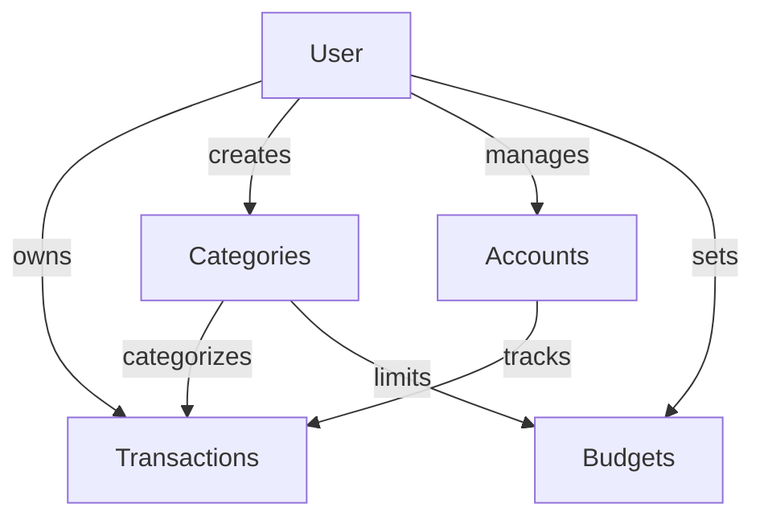
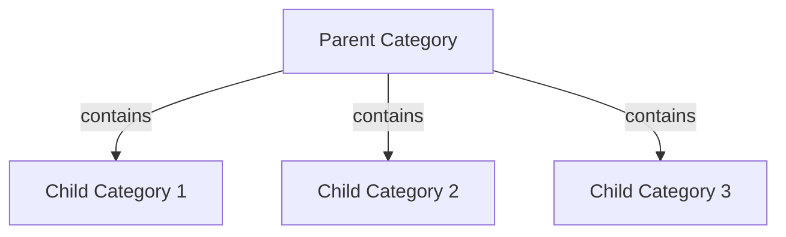

## Overview

Your Finance App uses **PostgreSQL** as its primary database, managed through **Prisma ORM**. The schema is designed for multi-tenant operation with soft deletes, hierarchical data, and optimized indexing.

## Technology Stack

<CardGroup cols={3}>
  <Card title="PostgreSQL" icon="database">
    Production-grade relational database
  </Card>
  <Card title="Prisma" icon="cube">
    Type-safe ORM with migrations
  </Card>
  <Card title="Neon" icon="cloud">
    Serverless PostgreSQL provider
  </Card>
</CardGroup>

## Schema Configuration

<CodeGroup>
```prisma prisma/schema.prisma
generator client {
  provider = "prisma-client-js"
}

datasource db {
  provider  = "postgresql"
  url       = env("DATABASE_URL")
  directUrl = env("DIRECT_URL")
}
```
</CodeGroup>

<Info>
The `directUrl` is used for migrations in serverless environments like Neon, bypassing connection pooling.
</Info>

## Data Models

### User Model

The central entity representing application users with support for multiple authentication providers:

<CodeGroup>
```prisma User Model
model User {
  id       String @id @default(uuid())
  
  // Identity
  email    String  @unique
  password String?  // Optional for OAuth users
  
  firstName String @map("first_name")
  lastName  String @map("last_name")
  avatarUrl String?
  phone     String?

  // Social Authentication
  authProvider   AuthProvider @default(LOCAL) @map("auth_provider")
  authProviderId String?      @map("auth_provider_id")

  // Preferences
  currency       String @default("ARS")
  fiscalStartDay Int    @default(1)
  timezone       String @default("America/Argentina/Buenos_Aires")
  language       String @default("es")

  // Security
  role          Role      @default(USER)
  isActive      Boolean   @default(true)
  lastLogin     DateTime?
  
  resetToken       String?   @unique
  resetTokenExpiry DateTime?
  emailVerified    DateTime?

  // SaaS Business Model
  subscription     SubscriptionTier @default(FREE)
  externalCustomerId String?  // Stripe/MercadoPago

  // Timestamps
  createdAt DateTime  @default(now()) @map("created_at")
  updatedAt DateTime  @updatedAt @map("updated_at")
  deletedAt DateTime? @map("deleted_at")

  // Relationships
  transactions Transaction[]
  categories   Category[]
  accounts     Account[]
  budgets      Budget[]

  @@index([email])
  @@index([authProviderId])
  @@map("users")
}
```
</CodeGroup>

<Accordion title="User Model Features">
  - **Multi-provider Auth**: Supports LOCAL, GOOGLE, MICROSOFT, and APPLE authentication
  - **Soft Deletes**: `deletedAt` field for data retention
  - **Localization**: User-specific timezone, language, and currency settings
  - **Password Recovery**: Token-based reset mechanism with expiry
  - **SaaS Ready**: Subscription tier and external payment provider integration
</Accordion>

### Transaction Model

Records all financial transactions (income, expense, and transfers):

<CodeGroup>
```prisma Transaction Model
model Transaction {
  id          String    @id @default(uuid())
  userId      String    @map("user_id")
  type        String    // 'income' | 'expense' | 'transfer'
  amount      Decimal   @db.Decimal(15, 2)
  currency    String    @default("ARS")
  description String?   @db.Text
  date        DateTime  @default(now())
  categoryId  String?   @map("category_id")
  accountId   String?   @map("account_id")
  
  createdAt   DateTime  @default(now()) @map("created_at")
  updatedAt   DateTime  @updatedAt @map("updated_at")
  deletedAt   DateTime? @map("deleted_at")
  
  // Relationships
  user     User      @relation(fields: [userId], references: [id], onDelete: Cascade)
  category Category? @relation(fields: [categoryId], references: [id], onDelete: SetNull)
  account  Account?  @relation(fields: [accountId], references: [id])
  
  // Performance Indexes
  @@index([userId])
  @@index([date])
  @@index([categoryId])
  @@index([type])
  @@map("transactions")
}
```
</CodeGroup>

<Warning>
Transactions use `Decimal(15, 2)` for precise monetary calculations, avoiding floating-point errors.
</Warning>

**Key Features:**
- **Cascade Delete**: Deleting a user removes all their transactions
- **Soft Delete Pattern**: `deletedAt` allows transaction recovery
- **Optimized Queries**: Indexes on `userId`, `date`, `categoryId`, and `type`
- **Flexible Categories**: `onDelete: SetNull` preserves transactions if category is deleted

### Category Model

Hierarchical category system supporting parent-child relationships:

<CodeGroup>
```prisma Category Model
model Category {
  id      String  @id @default(uuid())
  userId  String  @map("user_id")
  name    String
  type    String  // 'income' | 'expense' | 'both'
  isFixed Boolean @default(false)
  color   String?
  icon    String?
  
  // Hierarchy (Self-referential)
  parentId  String?   @map("parent_id")
  parent    Category? @relation("CategoryHierarchy", fields: [parentId], references: [id])
  children  Category[] @relation("CategoryHierarchy")

  createdAt DateTime  @default(now()) @map("created_at")
  updatedAt DateTime  @updatedAt @map("updated_at")
  deletedAt DateTime? @map("deleted_at")
  
  user         User          @relation(fields: [userId], references: [id], onDelete: Cascade)
  transactions Transaction[]
  budgets      Budget[]
  
  @@unique([userId, name, type, parentId])
  @@index([userId])
  @@map("categories")
}
```
</CodeGroup>

**Hierarchical Design:**
```
Serviceios (Parent)
├── Internet (Child)
├── Streaming (Child)
└── Otros (Child)

Alimentación (Parent)
├── Supermercado (Child)
├── Restaurantes (Child)
└── Otros (Child)
```

<Tip>
The `@@unique([userId, name, type, parentId])` constraint allows "Otros" subcategory under different parents.
</Tip>

### Account Model

Multi-purpose account system for wallets, savings, investments, and credit cards:

<CodeGroup>
```prisma Account Model
model Account {
  id           String      @id @default(uuid())
  name         String
  type         AccountType @default(WALLET)
  currency     String      @default("ARS")
  balance      Decimal     @default(0) @db.Decimal(15, 2)
  color        String?
  icon         String      @default("wallet")
  
  // Optional fields for SAVINGS type
  targetAmount Decimal?    @db.Decimal(10, 2)
  targetDate   DateTime?
  
  isDefault    Boolean     @default(false)
  userId       String
  user         User        @relation(fields: [userId], references: [id], onDelete: Cascade)

  createdAt DateTime @default(now())
  updatedAt DateTime @updatedAt

  transactions Transaction[]

  @@map("accounts")
}

enum AccountType {
  WALLET        // Cash, Bank, Digital Wallet
  SAVINGS       // Goals, Savings
  INVESTMENT    // Investments
  CREDIT_CARD   // Credit Cards
}
```
</CodeGroup>

**Account Types:**

<CardGroup cols={2}>
  <Card title="WALLET" icon="wallet">
    Daily cash flow - bank accounts, cash, digital wallets
  </Card>
  <Card title="SAVINGS" icon="piggy-bank">
    Accumulation goals with optional target amount and date
  </Card>
  <Card title="INVESTMENT" icon="chart-line">
    Investment portfolios and assets
  </Card>
  <Card title="CREDIT_CARD" icon="credit-card">
    Credit cards for future expense tracking
  </Card>
</CardGroup>

### Budget Model

Monthly budget allocation per category:

<CodeGroup>
```prisma Budget Model
model Budget {
  id         String  @id @default(uuid())
  amount     Decimal @db.Decimal(10, 2)
  month      Int
  year       Int

  userId     String
  user       User     @relation(fields: [userId], references: [id], onDelete: Cascade)

  categoryId String
  category   Category @relation(fields: [categoryId], references: [id], onDelete: Cascade)

  createdAt DateTime @default(now())
  updatedAt DateTime @updatedAt

  @@unique([userId, categoryId, month, year])
  @@map("budgets")
}
```
</CodeGroup>

<Info>
The unique constraint prevents duplicate budgets for the same category in a given month.
</Info>

## Enumerations

<CodeGroup>
```prisma Enums
enum Role {
  USER
  ADMIN
}

enum SubscriptionTier {
  FREE
  PRO
}

enum CategoryType {
  INCOME
  EXPENSE
  BOTH
}

enum TransactionType {
  INCOME
  EXPENSE
  TRANSFER
}

enum AuthProvider {
  LOCAL
  GOOGLE
  MICROSOFT
  APPLE
}
```
</CodeGroup>

## Relationships

### One-to-Many Relationships



### Self-Referential Relationship



## Indexing Strategy

Indexes are strategically placed for common query patterns:

<AccordionGroup>
  <Accordion title="User Indexes">
    - `email`: Fast login lookups
    - `authProviderId`: Quick OAuth authentication
  </Accordion>
  
  <Accordion title="Transaction Indexes">
    - `userId`: User-specific transaction queries
    - `date`: Date range filtering for reports
    - `categoryId`: Category-based filtering
    - `type`: Income vs expense queries
  </Accordion>
  
  <Accordion title="Category Indexes">
    - `userId`: User-specific category lists
  </Accordion>
</AccordionGroup>

## Soft Delete Pattern

All major entities implement soft deletes via `deletedAt`:

```typescript
// Service implementation
async softDelete(id: string, userId: string) {
  return this.prisma.transaction.update({
    where: { id, userId },
    data: { deletedAt: new Date() },
  });
}

// Query filtering
async findAll(userId: string) {
  return this.prisma.transaction.findMany({
    where: {
      userId,
      deletedAt: null,  // Exclude soft-deleted records
    },
  });
}
```

<Tip>
Soft deletes enable data recovery and maintain referential integrity for analytics.
</Tip>

## Migration Strategy

Prisma migrations are version-controlled and applied via CLI:

```bash
# Create a new migration
prisma migrate dev --name add_soft_deletes

# Apply migrations in production
prisma migrate deploy

# Reset database (development only)
prisma migrate reset
```

<Warning>
Always review generated migrations before applying to production. Some schema changes may require data backfilling.
</Warning>

## Performance Considerations

<CardGroup cols={2}>
  <Card title="Connection Pooling" icon="server">
    Prisma uses connection pooling to manage database connections efficiently
  </Card>
  
  <Card title="Query Optimization" icon="gauge">
    Strategic indexes on foreign keys and frequently queried fields
  </Card>
  
  <Card title="Decimal Precision" icon="calculator">
    Using `Decimal` type prevents floating-point arithmetic errors
  </Card>
  
  <Card title="Cascade Deletes" icon="trash">
    Automatic cleanup of related records when parent is deleted
  </Card>
</CardGroup>

## Next Steps

<CardGroup cols={2}>
  <Card title="Authentication" icon="lock" href="/architecture/authentication">
    Learn how user authentication works with JWT and OAuth
  </Card>
  
  <Card title="API Reference" icon="code" href="/api/authentication/register">
    Explore available API endpoints
  </Card>
</CardGroup>